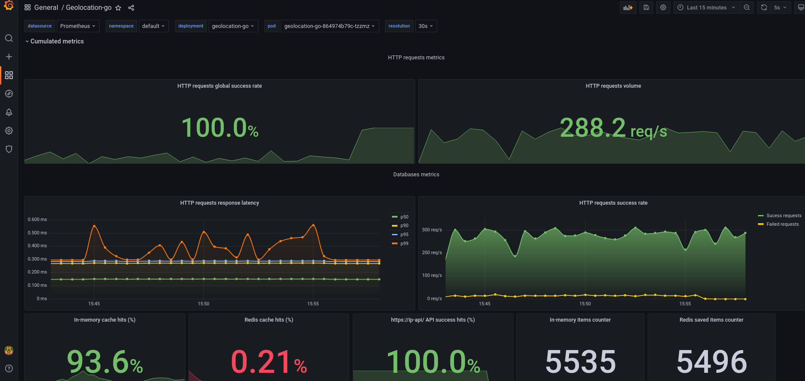

# geolocation-go [](https://github.com/lescactus/geolocation-go/actions/workflows/docker.yml) [](https://github.com/lescactus/geolocation-go/actions/workflows/go.yml) [](https://github.com/lescactus/geolocation-go/actions/workflows/k8s.yml)

This repository contains a simple geolocation api microservice, fast, reliable, Kubernetes friendly and ready written in go as a proof of concept.

## Motivations

Study the feasibility of having a geolocation REST API microservice running alongside our other microservices in Kubernetes to avoid relying on the `Cloudfront-Viewer-Country` http headers.
The requirements are:

* Reliability
* Fast
* Concurrent

## Design

`geolocation-go` is written in Go, a fery fast and performant garbaged collected and concurrent programming language.

It expose a simple `GET /rest/v1/{ip}` REST endpoint.

Parameter: 

* `/rest/v1/{ip}` (string) - IPv4 

Response:

* `{"ip":"88.74.7.1","country_code":"DE","country_name":"Germany","city":"Düsseldorf","latitude":51.2217,"longitude":6.77616}`

To retrieve the country code and country name of the given IP address, `geolocation-go` use the [ip-api.com](https://ip-api.com/) real-time Geolocation API, and then cache it in-memory and in Redis for later fast retrievals.

### Flow

```
                                                                                          
                                                                                (2)
                                                                         +--------------> In-memory cache lookup
                                                                         |                       ^ 
                                                                         |                       *
                                              +------------------------+ |                       *
+-------------+            (1)                |                        | |                       * Update in-memory cache
|             |   GET /rest/v1/{ip}           |                        | |                       *
|             +------------------------------>|                        | |      (3)              *
|   Client    |                               |     geolocation-go     | +--------------> Redis lookup (optional)
|             |          (5)                  |                        | |                       ^ 
|             |<------------------------------+                        | |                       *
+-------------+       200 - OK                |                        | |                       * Update Redis cache
                                              +------------------------+ |                       *
                                                                         |                       *
                                                                         |      (4)              *
                                                                         +--------------> http://ip-api.com/json/{ip} lookup (optional)
```

1) Client make an HTTP request to `/rest/v1/{ip}`

2) `geolocation-go` will lookup for in his in-memory datastore and send the response if cache HIT. In case of cache MISS, go to step 3)

3) `geolocation-go` will lookup in Redis, send the response if cache HIT and add the response in his in-memory datastore asynchronously. In case of cache MISS, go to step 4)

4) `geolocation-go` will make an HTTP call to the [ip-api.com](https://ip-api.com/docs/api:json) API, send back the response to the client and add the response to Redis and the in-memory datastore asynchronously.

## Configuration

`geolocation-go` is a 12-factor app using [Viper](https://github.com/spf13/viper) as a configuration manager. It can read configuration from environment variables or from .env files.

### Available variables

* `APP_ADDR`(default value: `:8080`). Define the TCP address for the server to listen on, in the form "host:port".

* `APP_CONFIG_NAME` (default value: `.env`). Name of the configuration file to read from.

* `APP_CONFIG_PATH` (default value: `.`). Directory containing the configuration file to read from.

* `SERVER_READ_TIMEOUT` (default value: `30s`). Maximum duration for reading the entire request, including the body (`ReadTimeout`).

* `SERVER_READ_HEADER_TIMEOUT` (default value: `10s`). Amount of time allowed to read request headers (`ReadHeaderTimeout`).

* `SERVER_WRITE_TIMEOUT` (default value: `30s`). Maximum duration before timing out writes of the response (`WriteTimeout`).

* `LOGGER_LOG_LEVEL` (default value: `info`). Logger log level. Available values are  "trace", "debug", "info", "warn", "error", "fatal", "panic" [ref](https://pkg.go.dev/github.com/rs/zerolog@v1.26.1#pkg-variables)

* `LOGGER_DURATION_FIELD_UNIT` (default value: `ms`). Set the logger unit for `time.Duration` type fields. Available values are "ms", "millisecond", "s", "second".

* `LOGGER_FORMAT` (default value: `json`). Set the logger format. Available values are "json", "console".

* `PROMETHEUS` (default value: `true`). Enable publishing Prometheus metrics.

* `PROMETHEUS_PATH` (default value: `/metrics`). Metrics handler path.

* `REDIS_CONNECTION_STRING` (default value `redis://localhost:6379`). Connection string to connect to Redis. The format is the following: `"redis://<user>:<pass>@<host>:<port>/<db>"`.

* `GEOLOCATION_API` (default value `ip-api`). Define which geolocation API to use to retrieve geo IP information. Available options are:
       - [`ip-api`](https://ip-api.com/)

* `IP_API_BASE_URL` (default value: `http://ip-api.com/json/`). Base URL for the [`ip-api`](https://ip-api.com/) API. Note that https is not available with the free plan.

* `HTTP_CLIENT_TIMEOUT` (default value: `15s`). Timeout value for the http client.

* `PPROF` (default value: `false`). Enable the pprof server. When enable, `pprof` is available at `http://127.0.0.1:6060/debug/pprof`

## Monitoring

`geolocation-go` provides [Prometheus](https://prometheus.io/) metrics and comes with a [Grafana](https://grafana.com/docs/grafana/) dashboard located in `deploy/grafana/dashboard.json`.

### Installation with [`kube-prometheus-stack`](https://github.com/prometheus-community/helm-charts/tree/main/charts/kube-prometheus-stack)

Install [`kube-prometheus-stack`](https://github.com/prometheus-community/helm-charts/tree/main/charts/kube-prometheus-stack) in your Kubernetes cluster:

```sh
# Add helm repository
helm repo add prometheus-community https://prometheus-community.github.io/helm-charts
helm repo update

# Install the Prometheus operator and the kube-prometheus-stack
helm install \
       prometheus-operator \
       prometheus-community/kube-prometheus-stack \
       --create-namespace \
       --namespace monitoring

# Access the Grafana web interface through http://localhost:8080/ (default credentials: admin/prom-operator)
kubectl port-forward -n monitoring svc/prometheus-operator-grafana 8080:3000
```

To install the dashboard, go to "Menu" > "Create" > "Import" > "Upload json file" and upload `deploy/grafana/dashboard.json`.

<details>
<summary>Click to expand</summary>

</details>